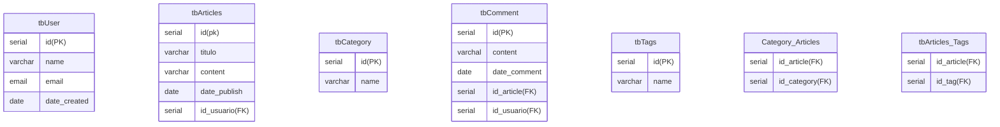

# SCRIPT DATABASE

1. **Tabelas Principais**:
    - **Usuários** (Users)
    - **Artigos** (Articles)
    - **Categorias** (Categories)
    - **Comentários** (Comments)
    - **Tags** (Tags)

2. **Relacionamentos**:
    - Um usuário pode escrever muitos artigos (relação um-para-muitos entre `Users` e `Articles`).
    - Um artigo pode pertencer a uma ou mais categorias (relação muitos-para-muitos entre `Articles` e `Categories`).
    - Um artigo pode ter muitos comentários (relação um-para-muitos entre `Articles` e `Comments`).
    - Um usuário pode fazer muitos comentários (relação um-para-muitos entre `Users` e `Comments`).
    - Um artigo pode ter muitas tags (relação muitos-para-muitos entre `Articles` e `Tags`).

3. **Estrutura das Tabelas**:
    - **Usuários (Users)**:
        - id (PK)
        - nome
        - email
        - senha
        - data_criacao

    - **Artigos (Articles)**:
        - id (PK)
        - titulo
        - conteudo
        - data_publicacao
        - id_usuario (FK para Users)
        
    - **Categorias (Categories)**:
        - id (PK)
        - nome

    - **Comentários (Comments)**:
        - id (PK)
        - conteudo
        - data_comentario
        - id_artigo (FK para Articles)
        - id_usuario (FK para Users)

    - **Tags (Tags)**:
        - id (PK)
        - nome

    - **Artigos_Categorias (Articles_Categories)** (Tabela de associação):
        - id_artigo (FK para Articles)
        - id_categoria (FK para Categories)

    - **Artigos_Tags (Articles_Tags)** (Tabela de associação):
        - id_artigo (FK para Articles)
        - id_tag (FK para Tags)

### Diagrama de Relacionamento (ERD):

```

### Relacionamentos:
- `Usuários` (1) ---- (M) `Artigos`
- `Artigos` (M) ---- (M) `Categorias` (através de `Artigos_Categorias`)
- `Artigos` (1) ---- (M) `Comentários`
- `Usuários` (1) ---- (M) `Comentários`
- `Artigos` (M) ---- (M) `Tags` (através de `Artigos_Tags`)
